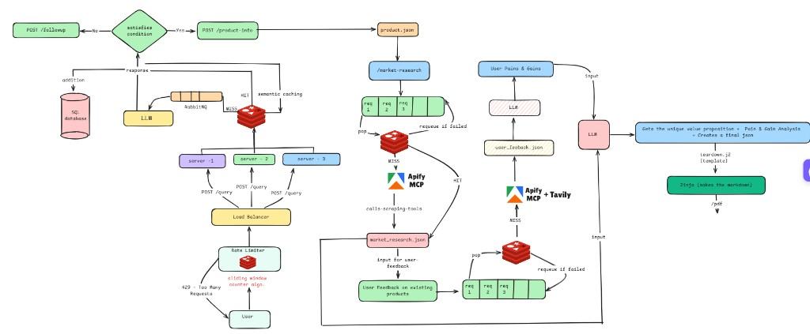
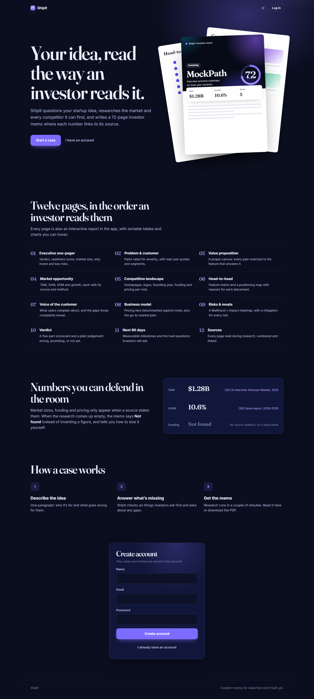
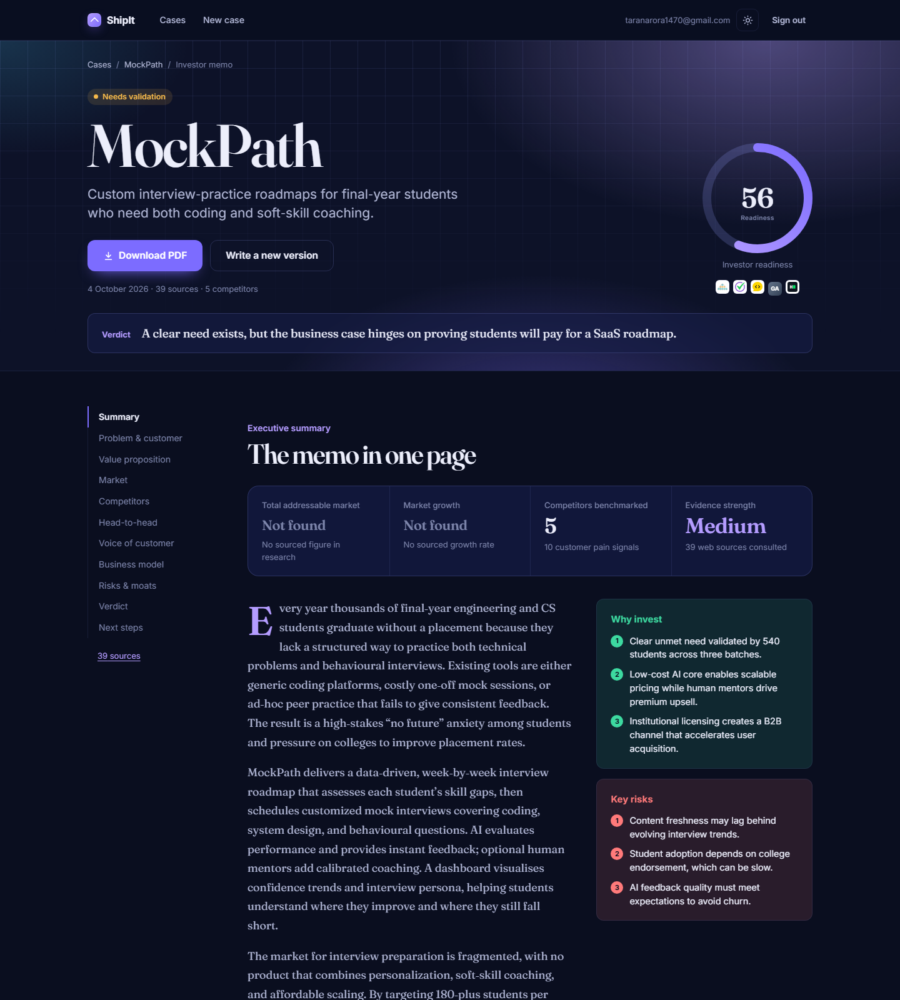
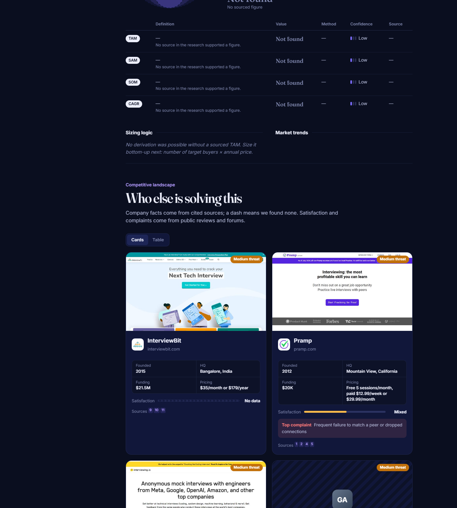
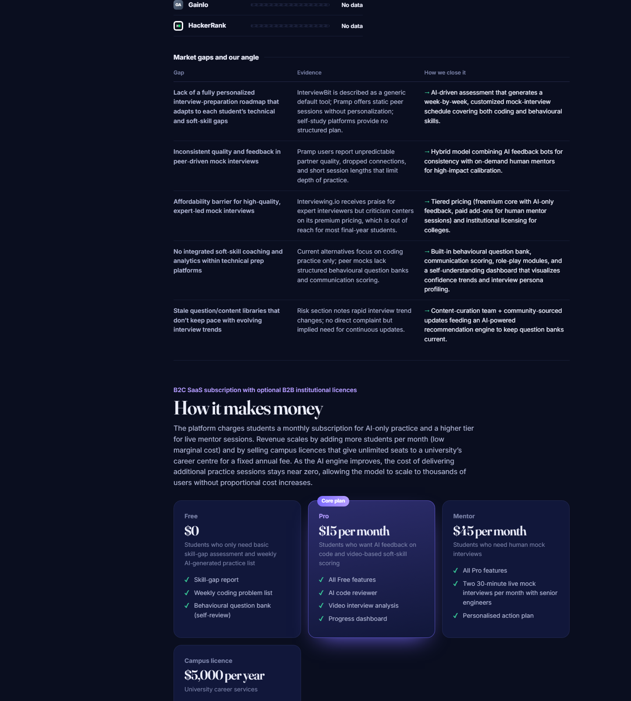
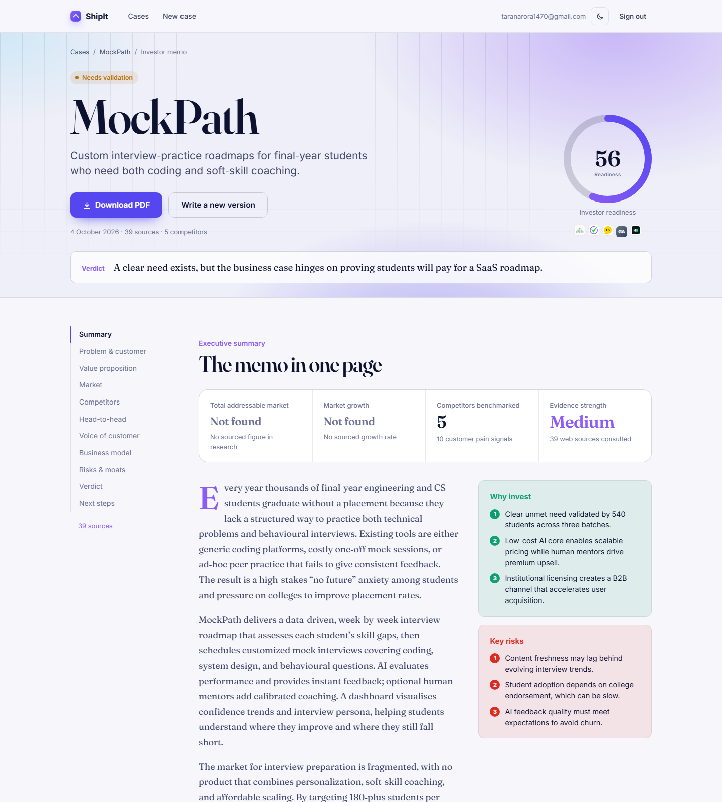

# ShipIt

**Turn any product idea into an investor-grade memo in 90 seconds.**

ShipIt is an AI-powered discovery platform that validates your product idea before you code. It runs rigorous market research, competitive analysis, and customer voice research—then synthesizes everything into a beautiful 12-page memo with sourced data.

No invented metrics. No hand-wavy market sizing. Just facts, sources, and a clear verdict on whether your idea is worth building.

---

## Scaling plan



---

## The Problem

Founders spend weeks validating ideas the wrong way:
- **Analysis paralysis** — What questions should I even ask?
- **Confirmation bias** — Cherry-picking data that supports the idea.
- **Shallow research** — A Google search and a spreadsheet isn't validation.
- **Wasted months** — Building a product no one wants.

ShipIt fixes this by forcing you to think through every dimension of your idea *before* you write a line of code.

---

## What You Get

### 🎯 The Memo: 12 Pages of Investor-Ready Analysis

1. **Executive One-Pager** — Verdict, readiness score, key KPIs, and why to invest
2. **Problem & Customer** — Real pain points with user quotes and source citations
3. **Value Proposition** — Corrected Strategyzer canvas showing which reliever fixes which pain
4. **Market Opportunity** — TAM/SAM/SOM with method and confidence levels
5. **Competitive Landscape** — Competitor cards with logos, screenshots, pricing, and satisfaction
6. **Head-to-Head** — Feature matrix and positioning map with rationale
7. **Voice of Customer** — Sentiment analysis and recurring complaint themes
8. **Business Model** — Pricing tiers benchmarked against competitors
9. **Risks & Moats** — Likelihood×impact heatmap with mitigations
10. **Verdict** — Five-axis scorecard and final recommendation
11. **90-Day Plan** — Milestones and validation targets
12. **Sources** — Every number linked back to a cited source

### 📊 Interactive Report

Same memo rendered in the web app:
- Hoverable charts (positioning map, risk heatmap, radar)
- Sortable competitor table with live filtering
- Direct-label TAM circles and trend analysis
- Sources drawer—click any footnote to see where the data came from
- **Download PDF** for sharing with investors or your team

### 🔍 How It Works

1. **Answer 6 Questions** about your customer, problem, solution, and validation
2. **AutoResearch** — Tavily searches for real competitors and market data
3. **Capture Assets** — Playwright screenshots competitor homepages; Google favicon API for logos
4. **Generate Memo** — Four parallel Groq LLM calls write sections in under 2 minutes
5. **Render PDF** — Chromium prints the memo to A4 with styled headers/footers

Every number in the memo carries a source ID. Unsourced figures show "Not found" instead of being invented.

---

## Screenshots

### 🏠 Landing Page Hero
Bold headline, animated memo stack, and CTA buttons. The page immediately shows what ShipIt does.



---

### 📄 Report: Executive Summary
Verdict badge, **readiness score ring** (the large circle), four KPI tiles, and executive summary. This is page 1 that investors scan first.



---

### 🎯 Report: Value Proposition Canvas
The **Strategyzer canvas** — value map (square, left) and customer profile (circle, right) connected by **fit lines** showing which pain each feature relieves. Beautiful, data-driven visualization.



---

### 🏆 Report: Competitive Landscape
Real competitor **cards with live homepage screenshots**, logos, founding year, HQ, funding, pricing tiers, satisfaction score, and top complaint. Investors see you've done your research.



---

### 🌙 Light Theme
Same beautiful memo in light mode — dark navy and indigo becomes soft white and purple. Works perfectly at 1440px desktop and 375px mobile.



---

**Want to see every page?** Check out [`docs/SCREENSHOTS.md`](docs/SCREENSHOTS.md) for a full walkthrough of all 12 memo pages and interactive report features.

---

## Tech Stack

| Layer | Technology | Why |
|-------|-----------|-----|
| **API** | FastAPI + uvicorn | Async, automatic OpenAPI docs, Pydantic validation |
| **Database** | PostgreSQL + SQLAlchemy | ACID transactions, full-text search ready |
| **Auth** | JWT + Argon2 (passlib) | Stateless, secure password hashing |
| **Research** | Tavily API | Web search grounded in real results |
| **Screenshots** | Playwright + Chromium | Headless browser, reliable homepage captures |
| **LLM** | Groq (`gpt-oss-120b` / `gpt-oss-20b`) | Fast, structured output via Pydantic |
| **Background Tasks** | Celery + Redis | Async memo generation, progress streaming |
| **PDF Rendering** | Playwright (Chromium) | Renders HTML+SVG to A4 PDF |
| **Frontend** | React 19 + Vite | Modern SPA, React Router, no build complexity |
| **Design** | Plain CSS + design tokens | Dark/light theme, responsive down to 375px |
| **Deployment** | Docker + Nginx | Containerized, load-balanced, easy to scale |

---

## Quick Start

### Local Development (5 minutes)

**Prerequisites:** Python 3.12+, Node 18+, PostgreSQL, Redis

#### 1. Clone and install

```bash
git clone https://github.com/yourusername/shipit.git
cd shipit

# Backend
pip install -r Backend/requirements.txt

# Frontend
cd Frontend && npm install && cd ..
```

#### 2. Environment config

Create `Backend/.env`:

```env
DATABASE_URL="postgresql://localhost:5432/shipit"
GROQ_API_KEY="gsk_..."
TAVILY_API_KEY="tvly_..."
SECRET_KEY="dev-secret-change-in-prod"
```

#### 3. Run servers

**Terminal 1: Backend**
```bash
cd Backend
alembic upgrade head  # one-time: create schema
uvicorn main:app --reload
```

**Terminal 2: Frontend**
```bash
cd Frontend
npm run dev
```

Visit `http://localhost:5173` → Sign up → Create a case → Answer 6 questions → Watch the memo generate.

---

### Production (Docker)

```bash
docker compose up --build
```

This starts:
- **backend** (FastAPI on :8000)
- **celery** (background worker for memo generation)
- **db** (PostgreSQL)
- **redis** (Celery broker)
- **nginx** (reverse proxy on :80)

To scale to 3 backend replicas:
```bash
docker compose up --build --scale backend=3
```

Nginx automatically load-balances across them.

---

## API Reference

### Authentication
```bash
POST /api/signup
POST /api/login                    # returns JWT access_token
```

### Cases (Ideas)
```bash
GET  /api/projects                 # list all cases
GET  /api/projects/{id}            # case detail + discovery state
POST /api/projects/{id}/questions  # answer a question, get follow-ups
```

### Reports (Memos)
```bash
POST /api/projects/{id}/reports    # start memo generation
GET  /api/reports/{id}             # memo status & data (when ready)
GET  /api/reports/{id}/pdf         # download PDF (authenticated)
```

See `http://localhost:8000/docs` for the full OpenAPI spec.

---

## Project Structure

```
shipit/
├── Backend/
│   ├── main.py                     # FastAPI app
│   ├── db.py                       # PostgreSQL connection
│   ├── models/
│   │   └── user.py                 # User, Project, Report ORM models
│   ├── schemas/
│   │   ├── report.py               # InvestorReport Pydantic schema
│   │   └── ...
│   ├── routes/
│   │   ├── auth/                   # /api/signup, /api/login
│   │   ├── query/                  # Discovery pipeline
│   │   ├── research/               # Market research, competitor assets
│   │   └── report/                 # Memo generation, rendering, PDF
│   │       ├── generator.py        # 4 parallel LLM section calls
│   │       ├── charts.py           # SVG chart builders
│   │       ├── render.py           # HTML→PDF via Chromium
│   │       └── templates/
│   │           ├── report.html.j2  # 12-page memo template
│   │           └── report.css      # Print-optimized styles
│   ├── alembic/                    # Database migrations
│   ├── tasks.py                    # Celery background tasks
│   ├── requirements.txt            # Python dependencies
│   └── Dockerfile
├── Frontend/
│   ├── src/
│   │   ├── App.jsx                 # Router & auth guard
│   │   ├── api.js                  # HTTP client
│   │   ├── format.js               # Formatting helpers
│   │   ├── theme.js                # Dark/light mode
│   │   ├── index.css               # Design tokens
│   │   └── components/
│   │       ├── Landing.jsx         # Hero + auth page
│   │       ├── Dashboard.jsx       # Case grid
│   │       ├── workspace/
│   │       │   ├── Workspace.jsx   # 6 questions form
│   │       │   └── ReportProgress.jsx
│   │       └── report/             # 12-page report viewer
│   │           ├── ReportView.jsx
│   │           ├── sections.jsx
│   │           └── charts.jsx
│   ├── vite.config.js
│   ├── package.json
│   └── index.html
├── docker-compose.yml
└── README.md (this file)
```

---

## Key Features

### 🚀 Speed
- Memo generation: 60–90 seconds
- Live progress tracking (Celery PROGRESS meta)
- Parallel research (4 LLM calls + Tavily searches simultaneously)

### 📌 Sourced Data
- Every number cites a web source
- Unsourced figures show "Not found"
- Source registry tracks 100+ research results per memo

### 🎨 Beautiful Output
- 12-page A4 PDF with custom fonts (Inter, Fraunces)
- SVG charts with hover tooltips
- Dark/light theme, mobile-responsive
- Print-optimized CSS (paged media, headers/footers)

### 🔒 Secure
- JWT authentication
- Password hashing (Argon2)
- Report access gated by project ownership
- Images served from an authenticated asset store

### 🌐 Scalable
- Stateless API (horizontal scaling)
- Background tasks on Celery + Redis
- Database migrations with Alembic
- Docker Compose for easy orchestration

---

## Development

### Running Tests

```bash
# Backend
cd Backend
pytest

# Frontend
cd Frontend
npm run test
```

### Rebuilding the Memo Design (No LLM Calls)

Use the sample report fixture to iterate on PDF styles without burning LLM tokens:

```bash
cd Backend
python scripts/render_sample_report.py --png
# → generates output/sample_report.pdf + output/sample_pages/*.png
```

### Database Migrations

After editing `Backend/models/user.py`:

```bash
cd Backend
alembic revision --autogenerate -m "describe your change"
alembic upgrade head
```

### Linting & Building

```bash
# Backend
cd Backend && ../.venv/Scripts/python -m flake8

# Frontend
cd Frontend && npx eslint src && npm run build
```

---

## Environment Variables

### Required
- `DATABASE_URL` — PostgreSQL connection string
- `GROQ_API_KEY` — Groq API key (get from https://console.groq.com)
- `TAVILY_API_KEY` — Tavily search API (get from https://tavily.com)

### Optional
- `SECRET_KEY` — JWT signing secret (default: "change-me", set to random in production)
- `APIFY_API_KEY` — For deeper web scraping (off by default)
- `VOICE_USE_APIFY` — Enable Apify scraping (default: "false")
- `VOICE_COMPETITOR_LIMIT` — Max competitors to deep-research (default: "3")
- `TAVILY_VOICE_MAX_RESULTS` — Max Tavily results per search (default: "3")
- `AUTO_CREATE_DB` — Auto-create schema on startup (default: "true", disable in production)

### Groq Rate Limits

Your key may have limits. ShipIt handles this:
- Per-model rate-limit locks (separate queues for `gpt-oss-120b` and `gpt-oss-20b`)
- Automatic exponential backoff on 429 errors
- Prompt size capping (max ~4.5K tokens per call)

---

## Deployment Notes

### Database
- Use Alembic migrations (versioned schema changes)
- Set `AUTO_CREATE_DB=false` in production
- PostgreSQL 13+ recommended

### Redis
- Required for Celery (background memo generation)
- In production, use a managed Redis (AWS ElastiCache, etc.)
- Single-node setup fine for <10 concurrent memo generations

### Chromium
- Installed automatically in the Docker image
- Requires `playwright install --with-deps chromium` in Dockerfile
- Headless, uses system fonts (Inter + Fraunces bundled in assets/)

### SSL/TLS
- Nginx handles HTTPS (configure cert in `deploy/nginx.conf`)
- Behind a load balancer? Set `X-Forwarded-Proto: https` headers

---

## Troubleshooting

### "Not found" market size
The LLM couldn't find sourced data for that market category. Try:
- Refine the product description (add industry, geography)
- Check Tavily results manually: `https://tavily.com/search?q=your+market`

### Memo generation timeout
Check:
- Redis is running: `redis-cli ping` → should return `PONG`
- Celery worker is running: check Docker logs or `celery -A celery_app worker --loglevel=info`
- Database isn't locked: `psql shipit -c "SELECT * FROM reports WHERE status='running'"`

### PDF rendering errors
- Chromium may be missing fonts: verify `Backend/assets/fonts/` exists
- Large competitor datasets: reduce `VOICE_COMPETITOR_LIMIT` in `.env`

---

## Contributing

Contributions welcome! Before submitting a PR:

1. Create a feature branch: `git checkout -b feature/your-idea`
2. Make changes and test locally
3. Run linters: `pylint Backend/ && npx eslint Frontend/src/`
4. Commit with a clear message
5. Push and open a pull request

Areas we'd love help with:
- More chart types (sensitivity analysis, revenue model visuals)
- Custom report templates (one-pager, pitch deck PDF)
- Mobile app (React Native)
- Improved positioning map axes (currently LLM-chosen)

---

## License

MIT License — see LICENSE file for details.

---

## Acknowledgments

- **Groq** — Fast LLM inference
- **Tavily** — Web search API
- **Playwright** — Browser automation & PDF rendering
- **FastAPI** — Modern Python web framework
- **React** — UI library

---

## Documentation

- **[Quick Start Workflows](docs/QUICKSTART.md)** — 11 step-by-step guides (generate a memo, compare ideas, iterate, debug, etc.)
- **[Screenshots & Page Guide](docs/SCREENSHOTS.md)** — Visual walkthrough of all 12 memo pages and interactive features
- **[Backend/FLOW.md](Backend/FLOW.md)** — Deep dive into the research pipeline architecture

---

## Questions?

- 📖 Check [docs/QUICKSTART.md](docs/QUICKSTART.md) for common workflows
- 🐛 File an issue on GitHub for bugs
- 💬 Check the discussions tab for feature requests
- 🏗️ See [Backend/FLOW.md](Backend/FLOW.md) for technical deep-dives

**Made with 🚀 by [Your Team]**
